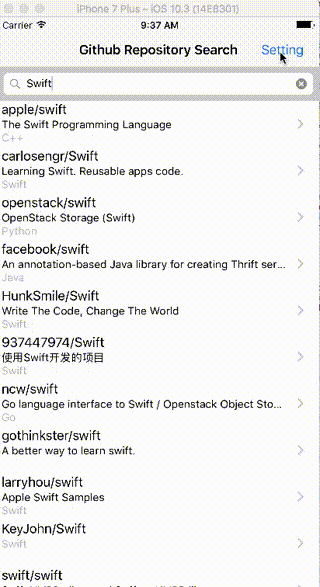
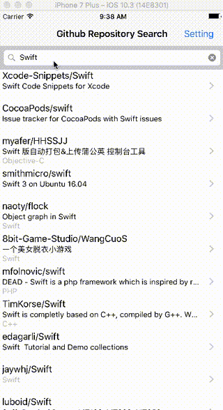

# GitHub Search Repository

## デモ

GitHubレポジトリのインクリメンタルサーチを実装。full_name、description、langageを表示。cellをクリックすると、リンクにとぶ。webページにはアクションボタンを付けたので、リンクのコピーやSafariで開くことが可能。

## 検索パラメタ

検索ではsortとorderの2種類のパラメータを追加することができる。

## エラー

API制限やAPI通信のエラー

